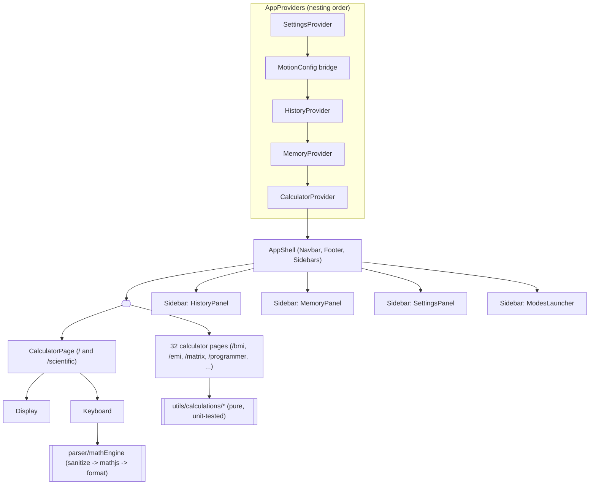
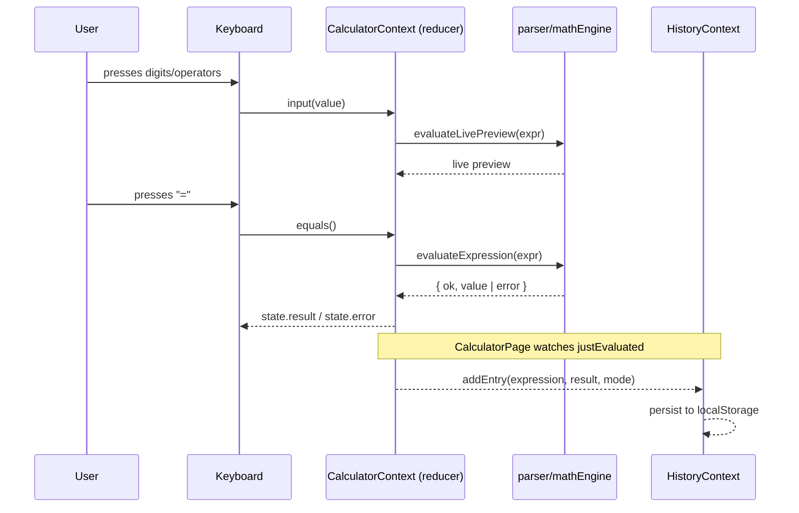
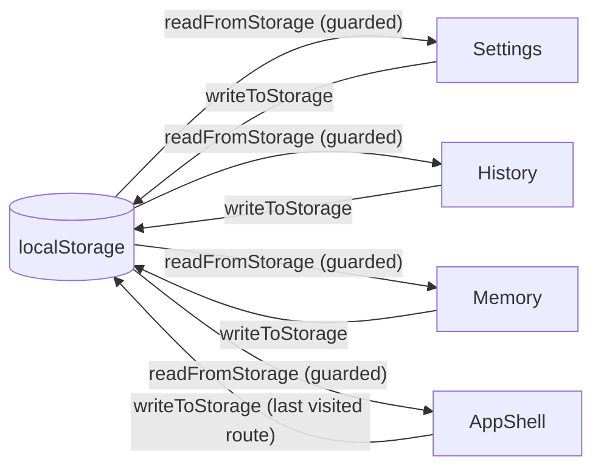

# Calculator Platform

A premium, multi-mode calculator platform built with React 19, TypeScript, and Vite — **35 calculator tools**, all live: Standard, Scientific, Programmer, and 32 finance/health/math/utility calculators, each its own route.

This repository was rebuilt from a single-file Create React App calculator into a modular, tested, accessible, installable web app. It replaces the original `Function("return " + expression)()` evaluator with a sandboxed math parser, and replaces the flat component tree with a layered architecture (components / hooks / context / store / parser / services).

## Table of contents

- [Features](#features)
- [Tech stack](#tech-stack)
- [Getting started](#getting-started)
- [Available scripts](#available-scripts)
- [Architecture](#architecture)
- [Security: the math parser](#security-the-math-parser)
- [State & persistence](#state--persistence)
- [Accessibility](#accessibility)
- [Progressive Web App](#progressive-web-app)
- [Testing](#testing)
- [Deployment](#deployment)
- [CI/CD](#cicd)
- [Contributing](#contributing)
- [Roadmap](#roadmap)

## Features

**Standard mode** — addition, subtraction, multiplication, division, decimal input, percentage, sign toggle, clear/delete, live result preview, keyboard input, animated results, and a natural-language input ("what is 15% of 800", "5 plus 3", "square root of 16") that translates plain English into a calculator expression before evaluating it through the same secure pipeline.

**Scientific mode** — sin/cos/tan and their inverses, sinh/cosh/tanh, log (base‑10) and ln, √ and ∛, `x^y`/`x²`/`x³`, `x!`, `1/x`, `|x|`, `mod`, floor/ceil/round/sign, π/e, degree/radian toggle, auto‑completion of missing closing parentheses.

**History** — unlimited entries (capped by a configurable limit), search/filter, pin, favorite, one‑tap reuse, copy result, delete one or clear all (pinned entries survive a clear), persisted to `localStorage`, and export to CSV, JSON, or PDF (the currently filtered/searched set, not just everything).

**Memory** — MC / MR / MS / M+ / M‑, a named multi‑value memory bank with inline rename and delete, persisted to `localStorage`.

**Programmer mode** — live BIN/OCT/DEC/HEX conversion of a single value, plus 32-bit unsigned bitwise operations (AND, OR, XOR, NOT, `<<`, `>>`) with the result shown in all four bases.

**32 finance/health/math/utility calculators** — each a pure, unit-tested calculation function plus a small, consistent form UI, reachable from the "Browse calculators" launcher (searchable, grouped by category) or a direct URL (`/bmi`, `/emi`, `/matrix`, etc.), with the browser back button and offline navigation both working correctly:

- **Finance** — Discount, GST (add/extract), EMI, Loan (with a yearly amortization breakdown), Mortgage, Currency (manual exchange rate), Investment (compound growth with monthly contributions), Compound Interest, Simple Interest, Profit & Loss, Margin
- **Health & Date** — Age, BMI (metric/imperial), Date Calculator (difference between dates, or add/subtract days)
- **Math** — LCM/GCD, Statistics (mean/range/variance/std-dev), Probability (nPr/nCr/event probability), Quadratic Solver (real or complex roots), Equation Solver (2×2 linear systems via Cramer's rule), Matrix Calculator (2×2, add/subtract/multiply/transpose/determinant), Vector Calculator (2D/3D, dot/cross product/magnitude), Polynomial Calculator (evaluate/add/multiply)
- **Utility** — Percentage (of / is-what-percent / % change), Tip (with split-by-people), Split Bill, Ratio (simplify or solve a proportion), Average, Random Number Generator, Unit Converter (length/weight/volume/area/speed/time/data/temperature), Base Converter, Roman Numeral Converter, Timezone Converter

**Settings** — theme (Light / Dark / AMOLED / High Contrast), 8 accent colors, font size, button size, animation speed, decimal precision, angle mode, history limit, layout density, sound effects (synthesized, no audio assets), haptic feedback (Vibration API), reduce‑motion override, a default-calculator picker (or "remember last used"), reset to defaults.

**Design** — glassmorphism surfaces, soft shadows, gradient backgrounds, animated tab indicator, button ripple/press feedback, shake‑on‑error, crossfading result transitions — all via Framer Motion and CSS custom properties, fully responsive from 320px phones to ultra‑wide desktops with zero horizontal overflow.

**Platform** — installable PWA with offline support (including deep-linked routes), WCAG AA–verified accessibility, keyboard‑first interaction, and a component architecture that grew from 11 to 35 live calculator modes without a rewrite (see [Roadmap](#roadmap)).

## Tech stack

| Layer              | Choice                                       |
| ------------------ | -------------------------------------------- |
| Framework          | React 19                                     |
| Language           | TypeScript (strict)                          |
| Build tool         | Vite                                         |
| Routing            | React Router (declarative mode)              |
| Math engine        | mathjs (number‑only build)                   |
| Animation          | Framer Motion                                |
| Icons              | react-icons                                  |
| State              | React Context + `useReducer`                 |
| Persistence        | `localStorage` (via a small guarded service) |
| PWA                | vite-plugin-pwa (Workbox)                    |
| Export             | jsPDF (dynamically imported, PDF only)       |
| Testing            | Vitest, React Testing Library, jest-axe      |
| Linting/formatting | ESLint (flat config) + Prettier              |
| Git hooks          | Husky + lint-staged + commitlint             |
| CI                 | GitHub Actions                               |
| Containerization   | Docker (multi-stage, nginx)                  |

## Getting started

Requires Node.js 22+.

```bash
npm install
npm run dev       # http://localhost:5173
```

## Available scripts

| Script                            | Description                                                      |
| --------------------------------- | ---------------------------------------------------------------- |
| `npm run dev`                     | Start the Vite dev server with HMR                               |
| `npm run build`                   | Type-check (`tsc -b`) then produce a production build in `dist/` |
| `npm run preview`                 | Serve the production build locally                               |
| `npm test`                        | Run the test suite once                                          |
| `npm run test:watch`              | Run tests in watch mode                                          |
| `npm run test:coverage`           | Run tests with a coverage report                                 |
| `npm run lint` / `lint:fix`       | ESLint, zero warnings allowed                                    |
| `npm run typecheck`               | `tsc -b --noEmit`                                                |
| `npm run format` / `format:check` | Prettier                                                         |

## Architecture

```
src/
├── components/        # UI, one folder per component: X.tsx, X.module.css, index.ts
│   ├── Button/ Display/ Keyboard/ Layout/ Navbar/ Sidebar/ Footer/
│   ├── History/ Memory/ Settings/ Scientific/ Modes/
│   └── common/         # IconButton, Modal, FormField, ResultCard, SegmentedControl,
│                       # PageHeader, FormPage — generic, reused across every calculator
├── pages/              # AppShell (chrome + all sidebars, via <Outlet/>), CalculatorPage
│                       # (Standard/Scientific), and one page per calculator (32 utility pages)
├── context/            # React Context objects + hooks (*.ts) and Providers (*.tsx)
├── store/              # Pure reducers consumed by the context Providers
├── parser/             # sanitizeExpression + mathEngine (see Security below)
├── hooks/              # useCalculatorKeyboardShortcuts, useDialogA11y, ...
├── services/           # localStorage wrapper
├── constants/          # keypad layouts, theme tokens, calculator mode registry
├── utils/
│   └── calculations/   # pure, unit-tested math for every utility calculator
├── types/               # shared TypeScript types
└── styles/             # global.css, themes.css (CSS custom properties)
```

**Routing**: `App.tsx` wraps every route in a single `AppShell`, which owns the Navbar, Footer, and all four Sidebars (History/Memory/Settings/"Browse calculators") and renders the active page via `<Outlet/>`. The calculator's expression state lives in `CalculatorProvider`, mounted once above the router — switching between `/` and `/scientific` is a route change that syncs `state.mode`, so the expression you were typing survives the switch. Utility calculator pages are unrelated, self-contained routes with their own local state.



**State flow** for a single calculation:



**Local storage flow** — every provider loads its slice lazily on mount and writes back on every change:



`AppShell` also persists the current route on every navigation to a known calculator path, so Settings → "Default calculator" → "Remember last used" can send you back to whichever calculator you had open, on the next visit.

`services/storage.ts` guards every read/write in `try/catch`, so a full quota, disabled storage (private browsing), or corrupted JSON degrades to in‑memory‑only behavior instead of crashing the app.

## Security: the math parser

The original app evaluated user input with `Function("return " + expression)()` — arbitrary code execution from a text field. This rebuild never uses `eval` or `Function` anywhere. Instead:

1. **`mathjs/number`** — the number-only build of mathjs (no BigNumber/Complex/Matrix/Unit types), which keeps the expression grammar minimal.
2. **`sanitizeExpression`** — a strict character whitelist (digits, operators, letters for function names, parentheses, `%`, `!`, and a few calculator symbols) runs _before_ anything reaches mathjs. Quote characters are never allowed, which closes mathjs's own documented `evaluate("...")`-from-within-an-expression vector at the door — no string literal can ever be constructed.
3. **Stateful, override-based trig** — rather than rewriting `sin(30)` → `sin(30*pi/180)` with regex (fragile under nesting), `sin`/`cos`/`tan`/`asin`/`acos`/`atan` are overridden once to consult a module-level angle-mode flag kept in sync with Settings.
4. **Friendly, exhaustive error handling** — division by zero, `NaN`, unbalanced parentheses, unknown symbols/functions, and overly long input all resolve to a typed `{ ok: false, error }` result instead of throwing into the UI.

See `src/parser/mathEngine.ts` for the full reasoning (including why `evaluate`/`parse`/`compile` are deliberately _not_ disabled — doing so breaks `math.evaluate()` itself, since they share an internal pipeline) and `src/parser/__tests__/` for the security-relevant test cases.

## Accessibility

Verified with `jest-axe` (in the test suite, every panel/theme/modal combination) and a manual `axe-core` sweep in a real Chromium browser across all 4 themes and all 8 accent colors — **zero violations** in either pass. Along the way this rebuild found and fixed real bugs, not just cosmetic ones:

- A global physical-keyboard shortcut (Enter → equals) was silently hijacking Enter/Space on _every_ focused button and swallowing keystrokes typed into the History search box. Fixed by deferring to whatever control natively owns the key.
- `role="dialog"` on `<aside>`/`<nav>` elements is invalid per ARIA (those elements carry their own implicit landmark role) — switched to plain `<div>`s with explicit roles.
- 6 of 8 accent-color presets failed WCAG AA contrast against the white text used on filled buttons/tabs. Rather than force one text color across every hue (which would force yellow/teal into muddy browns), each preset now carries its own pre-verified contrast color.
- The "danger" and "success" text colors in the Light theme were both under 4.5:1 against white.
- The shared `SegmentedControl` (used by the theme picker, angle-mode toggle, and several utility calculators) didn't wrap, so a 3-4-option control silently overflowed the page horizontally on narrow phones — found via an automated 320px-width overflow check, not a visual scan.
- The global physical-keyboard shortcut only deferred to a focused button/tab/link for Enter/Space, not digit/operator keys for a focused text input elsewhere on the page — so typing into the new natural-language input also leaked those same keystrokes into the calculator's own expression. Fixed by extending the focus check to cover digit/operator keys whenever a genuine text input or textarea has focus.

Also implemented: full keyboard navigation, a real Tab focus trap inside open dialogs (aware of nesting — a confirmation modal opened over a panel only lets the modal close on Escape), focus restored to the triggering element on close, `aria-live` regions on the display, visible focus rings, and a High Contrast theme whose accent is guaranteed rather than user-overridable. `prefers-reduced-motion` is respected two ways: CSS durations scale via a `--motion-scale` custom property, and Framer Motion's `<MotionConfig reducedMotion>` is driven by the same effective value (OS preference OR explicit Settings toggle).

## Progressive Web App

Installable (valid manifest + service worker + icons), works fully offline (Workbox precaches the app shell), and ships icons matching the app rather than the original CRA/React placeholder logos. Verified via a Playwright check: after going offline and reloading, the app still renders from cache with no console errors.

**Bundle size note**: PDF export (`jsPDF`) is dynamically imported rather than statically bundled. jsPDF's main entry point statically pulls in `html2canvas`/`dompurify` for its unused `.html()` renderer — a static import grew the main JS bundle from ~830KB to ~1.23MB for a feature most sessions never touch. Lazy-loading it inside `downloadHistoryAsPdf` keeps the main bundle at its original size and defers that weight to a separate chunk, fetched only when a user actually exports to PDF (and precached by Workbox for offline use afterward).

## Testing

344 tests across parser, calculation utilities, reducers, hooks, components, integration, and accessibility. Run `npm run test:coverage` for the full breakdown.

- **Parser/security tests** — arithmetic correctness, every scientific function, angle-mode switching, the string-literal injection vector, malformed input, overly long input.
- **Calculation tests** — every calculator's pure function (all 32, from Percentage through Matrix/Vector/Polynomial and the Programmer bitwise ops), including hand-checked known-value cases (EMI, a 3×3 determinant, a fixed-offset timezone conversion, `MCMXCIV`, etc.).
- **Reducer unit tests** — calculator/history/memory/settings reducers tested as pure functions.
- **Component tests** — Button, Display in isolation.
- **Integration tests** — full user flows through `CalculatorPage` (calculate, error recovery, history reuse/delete/clear, memory MS/M+/M-/MC, every Settings control) and through the router (launcher search/navigation, deep-linking, the default-calculator redirect simulated across a real unmount/remount, and a check that every registered mode renders as a clickable link).
- **Accessibility tests** — `jest-axe` on every panel/theme/modal state, focus management, keyboard-shortcut/native-control conflicts.

## Deployment

**Static hosting** (Vercel, Netlify, GitHub Pages, S3+CloudFront, etc.): run `npm run build` and deploy the `dist/` folder. It's a fully static SPA with a service worker — no server runtime required.

**Docker**:

```bash
docker build -t calculator-platform .
docker run -p 8080:80 calculator-platform
```

The `Dockerfile` is a multi-stage build (Node 22 → `npm ci && npm run build`, then nginx serving `dist/`). `nginx.conf` sets long-lived immutable caching for hashed assets, `no-cache` for the service worker and manifest (so PWA updates propagate), and an SPA fallback to `index.html` for future client-side routes.

## CI/CD

`.github/workflows/ci.yml` runs on every push/PR to `main`: install → lint → format check → typecheck → test with coverage → build, with the coverage report uploaded as a build artifact.

## Contributing

- Commits are linted by **commitlint** (`@commitlint/config-conventional`) via a Husky `commit-msg` hook — use [Conventional Commits](https://www.conventionalcommits.org/) (`feat:`, `fix:`, `chore:`, etc.).
- A Husky `pre-commit` hook runs **lint-staged** (ESLint + Prettier on staged files).
- Absolute imports are available via TS path aliases: `@components`, `@hooks`, `@utils`, `@parser`, `@services`, `@context`, `@store`, `@constants`, `@styles`, `@pages`, `@app-types`.

## Roadmap

**Live now**: all 35 modes in `src/constants/calculatorModes.ts` are `status: 'available'` — Standard, Scientific, Programmer, and every planned finance/health/math/utility calculator (Date, Loan, Mortgage, Currency, Unit Converter, Split Bill, Investment, Profit & Loss, Margin, Ratio, Average, LCM/GCD, Random, Statistics, Probability, Equation Solver, Quadratic Solver, Matrix, Vector, Polynomial, Base Converter, Roman Numeral, Timezone Converter, plus the original Percentage, Discount, GST, Tip, BMI, Age, Simple Interest, Compound Interest, EMI). The registry's `status` field and the launcher's coming-soon styling remain in place for any future mode — adding one is still just: a calculation function under `utils/calculations/` (+ tests), a page under `pages/` using the shared `FormPage`/`FormField`/`SelectField`/`TextAreaField`/`ResultCard`/`SegmentedControl` primitives, a route in `App.tsx`, and a registry entry.

Not yet built, and out of scope for this pass: voice input/speech output, OCR/camera math scanning, i18n/RTL, and a resizable desktop sidebar layout.
